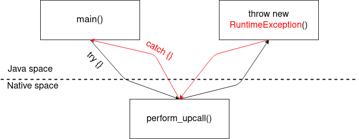

## Panama upcall example

This is a small example application, demonstrating that an exception, thrown inside a native upcall using Java Panama, cannot be caught.  
The project comes with a small native library called `libupcall`, consisting of a single function (`perform_upcall`), that takes a function pointer as its parameter and calls this function pointer.  
The Java application uses [Project Panama](https://openjdk.java.net/projects/panama/) to pass a Java method as parameter to `perform_upcall`. Inside this method, a `RuntimeException` is thrown. `perform_upcall` is called inside a `try`-block, catching every type of `Throwable`, so that the exception, thrown inside the upcall should be caught. However, instead of that, the exception's stack trace is printed and the JVM exits with a return code of `1`.



### Build and run

First, you need to build the native library:
 1. Change directory to `src/main/native`.
 2. Execute `./build.sh`.
 3. You should have the native library built as `libupcall.so` inside `src/main/native`. Change directory back into the project's root directory

Now, you can build the Java project:
 1. Make sure, you have a current version of JDK 19 with Project Panama installed on your system. You can always download the latest nightly build of the OpenJDK including Project Panama from [here](https://coconucos.cs.hhu.de/forschung/jdk/).
 2. Edit `gradle.properties` inside the project's root directory and let `org.gradle.java.installations.paths` point to your Panama JDK.
 3. Execute `./gradlew installDist`. For that, your default JDK must be any JDK with a version number up to and including 17, since Gradle does not support building with newer versions of Java. However, it can use the JDK pointed to inside your `gradle.properties` to build this project using Java 19.
 4. You can now execute the application (change `JAVA_HOME` to your Panama JDK): `JAVA_HOME="/path/to/your/panama-jdk" LD_LIBRARY_PATH="$LD_LIBRARY_PATH:src/main/native" ./build/install/panama-upcall/bin/panama-upcall`

### Output

Upon execution, you should see the following the output:
```text
WARNING: Using incubator modules: jdk.incubator.foreign
Hello from native code!
Hello from Java code!
java.lang.RuntimeException: Throwing an exception inside an upcall
        at de.hhu.bsinfo.panama.upcall.Application.lambda$static$0(Application.java:10)
        at de.hhu.bsinfo.panama.upcall.UpcallHelper.perform_upcall(UpcallHelper.java:15)
        at de.hhu.bsinfo.panama.upcall.Application.main(Application.java:15)
```

 - `Hello from native code!` is printed using `printf()` inside the native library.
 - `Hello from Java code!` is printed inside the Java upcall.
 - The stacktrace is printed after the exception is thrown. However, since we run the upcall inside a `try`-block, it should actually be caught and no stack trace be printed.

The expected output, if the exception had been caught, would look like the following:
```text
WARNING: Using incubator modules: jdk.incubator.foreign
Hello from native code!
Hello from Java code!
Exception caught!
Upcall finished!
```
